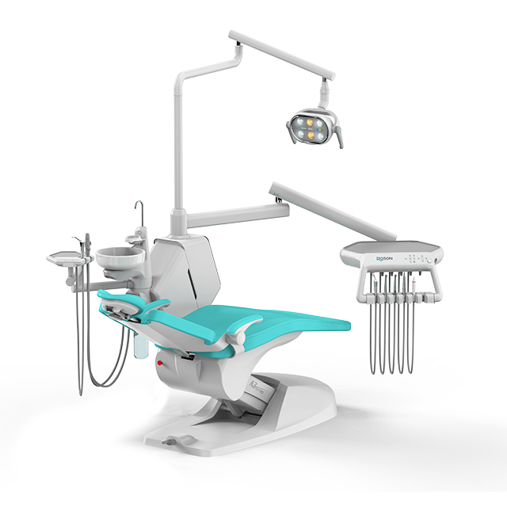
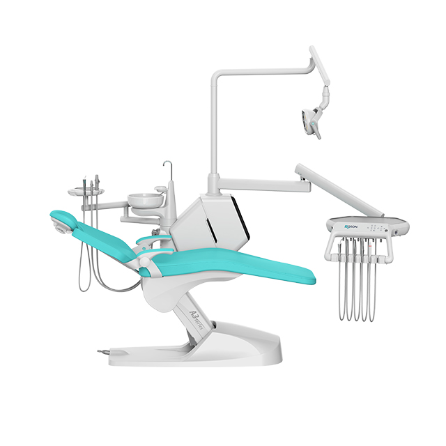

# Roson Smart Model KLT-6220 A3S

The Roson Smart Model A3S is designed to provide unparalleled reliability, comfort, and advanced technological integrations for modern dental practices.

## Key Features
- **Ergonomic Design:** Masterfully crafted for maximum patient comfort and dentist accessibility.
- **Medical-Grade Color LCD Display:** Features a high-resolution, intuitive interface for complete, effortless control.
- **Durable and Easy-to-Clean:** Built with premium materials to stand up to rigorous daily use while simplifying hygiene.
- **Multiple Color Choices Available:** Fully customizable to match your clinic's aesthetic.
- **Complete Customization:** Specific configuration can be customized entirely according to customer requirements.
