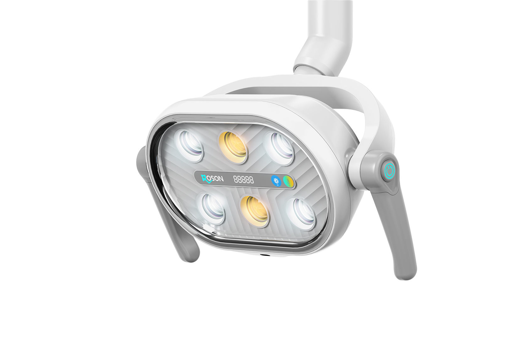
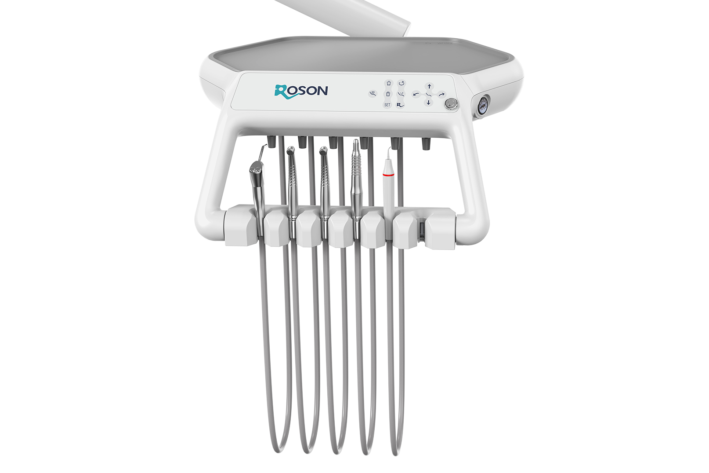
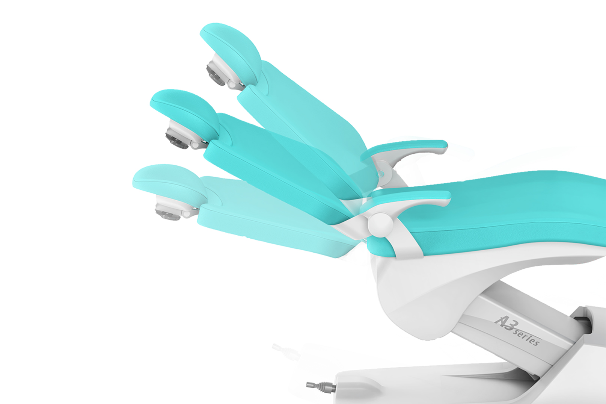
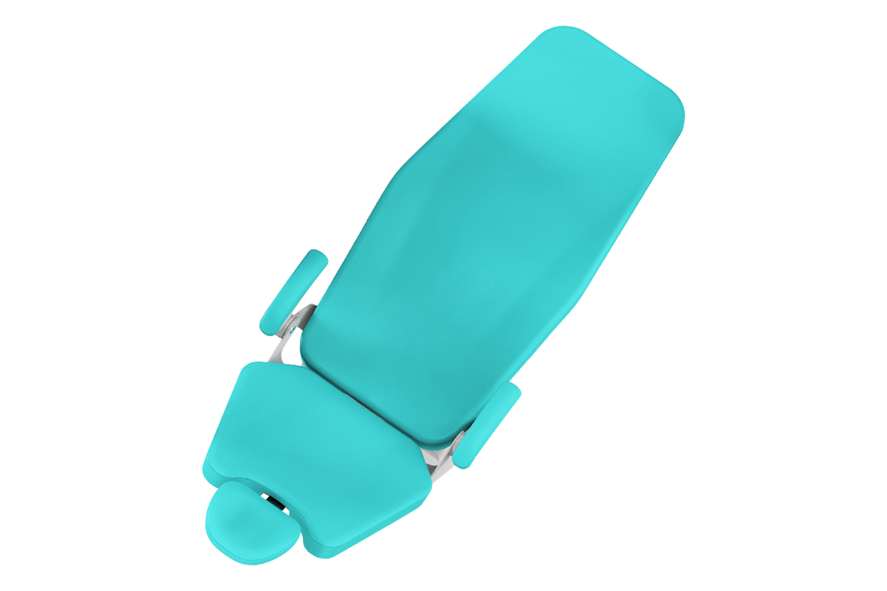
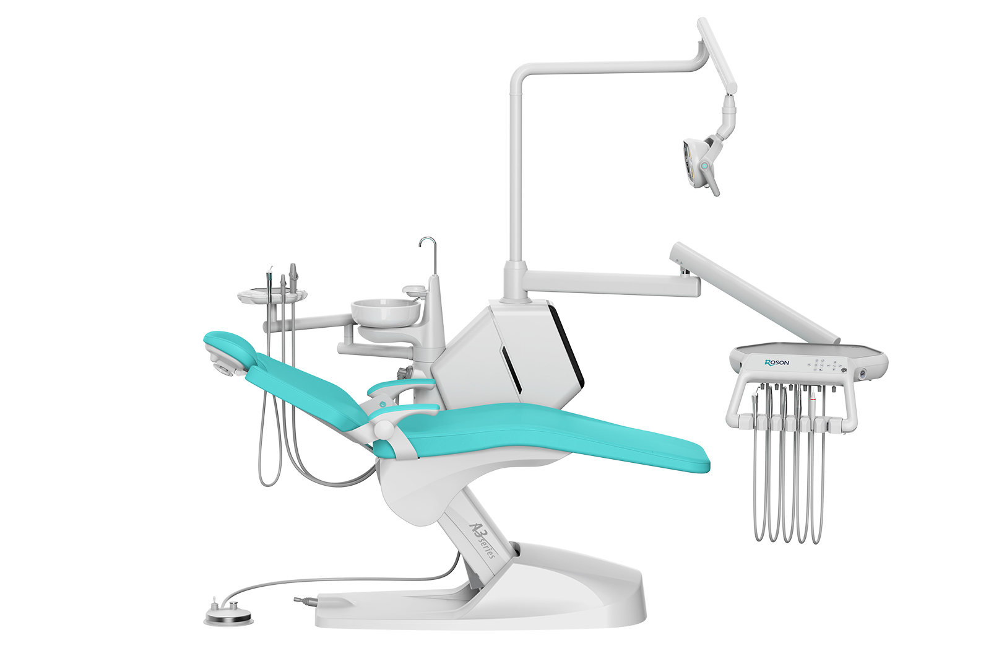
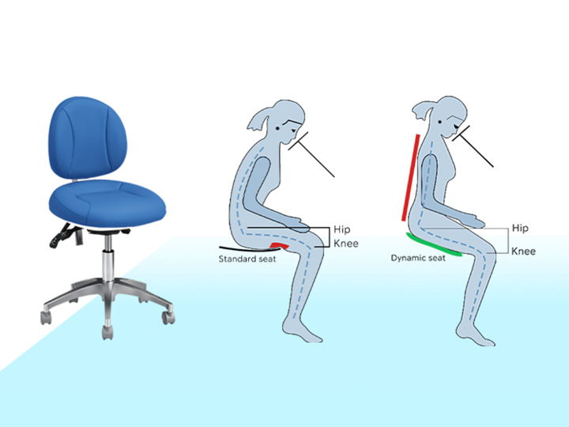
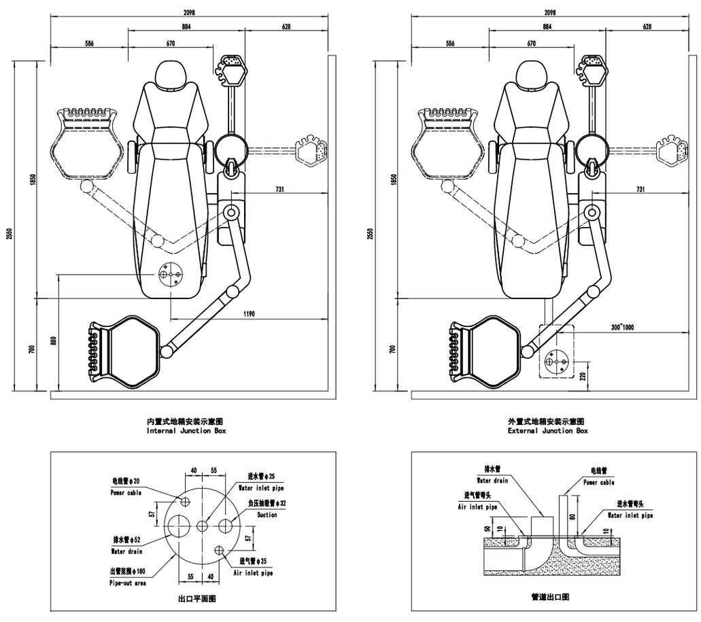

# Advanced Features and Components

The Roson Smart Model A3S incorporates advanced features to ensure superior dental care and maximize both patient comfort and practitioner efficiency.

## 01: 8-Rolight S Dental Light

- **Double mode control**
- **Digital illumination and color temperature**
- **Infrared non-inductive control**
- **Philips lamp beads**
- **Manual shortcut control**
- **Condition breathing lamp**

## 02: Handpiece Holder with 4 Adjustable Angles (30°-80°)

- **Every habit should be valued:** The angle of the bracket can be adjusted according to personal usage habits.
- **Flexible & Adjustable:** Easy to take and place instruments effortlessly.

## 03: Soft Start/Stop System

- **Embedded soft start/soft stop system:** Enjoy the "cloud experience" for smooth transitions.
- **Start/stop during treatment:** No frustration or sudden jolts.
- **A comfortable operation in no time.**

## 04: Seamless Microfiber Leather

- **Skin friendly:** Wear and scratch resistant.
- **Soft and breathable:** Ensures maximum patient coziness.
- **Fatigue-free:** "You don't get tired lying down for a long time."

## 08: One-Key Press, Chair Up to the Highest Position

- **Automated cycle:** 5 minutes automatically flushed spittoon.
- **No extra operation:** Eases your daily cleaning routine for maximum efficiency.

---

## Dynamic Comfort Design

The A3S ensures dynamic comfort with highly synchronized chair movements to adapt ergonomically to the patient’s natural body mechanics, ensuring optimal postural support.

## Technical Specifications

The layout and dimensions of the A3S are engineered for precision and fit easily into diverse clinic layouts.
