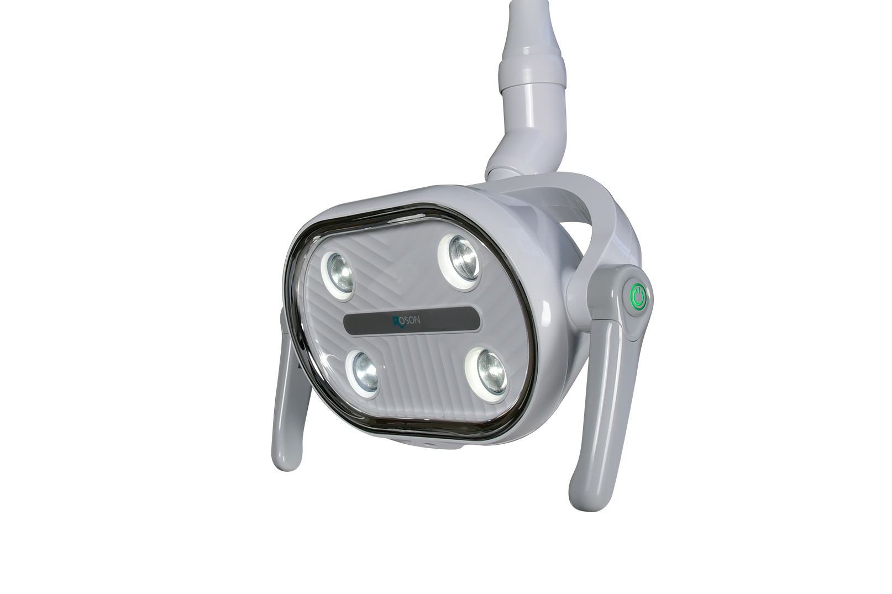
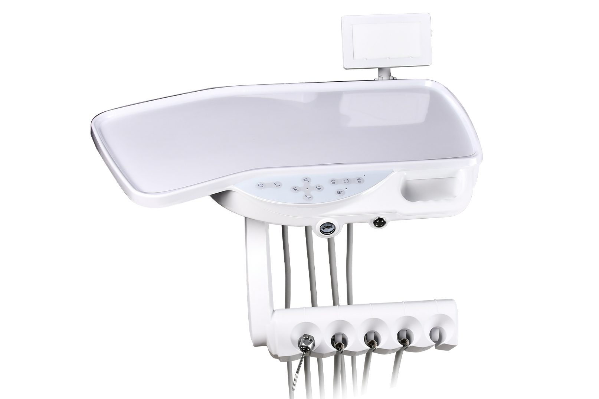
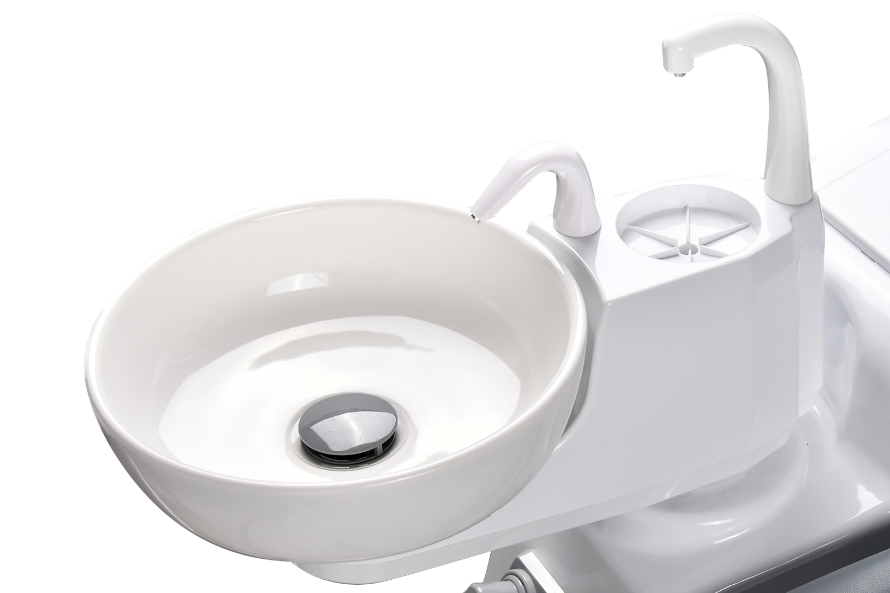
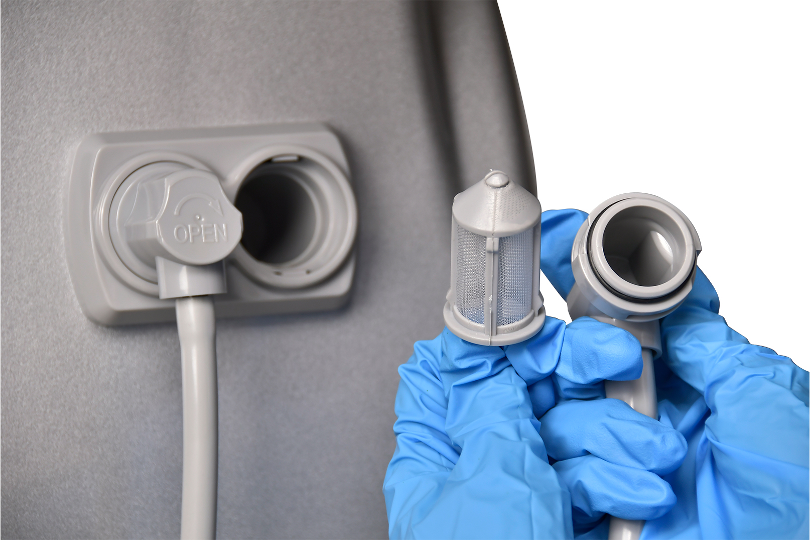
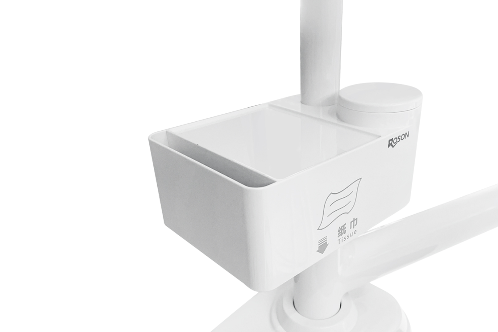
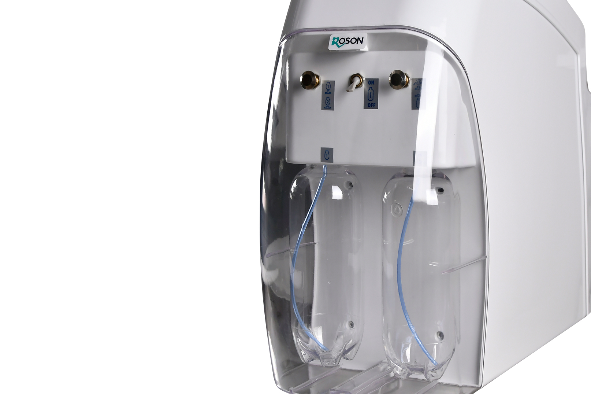
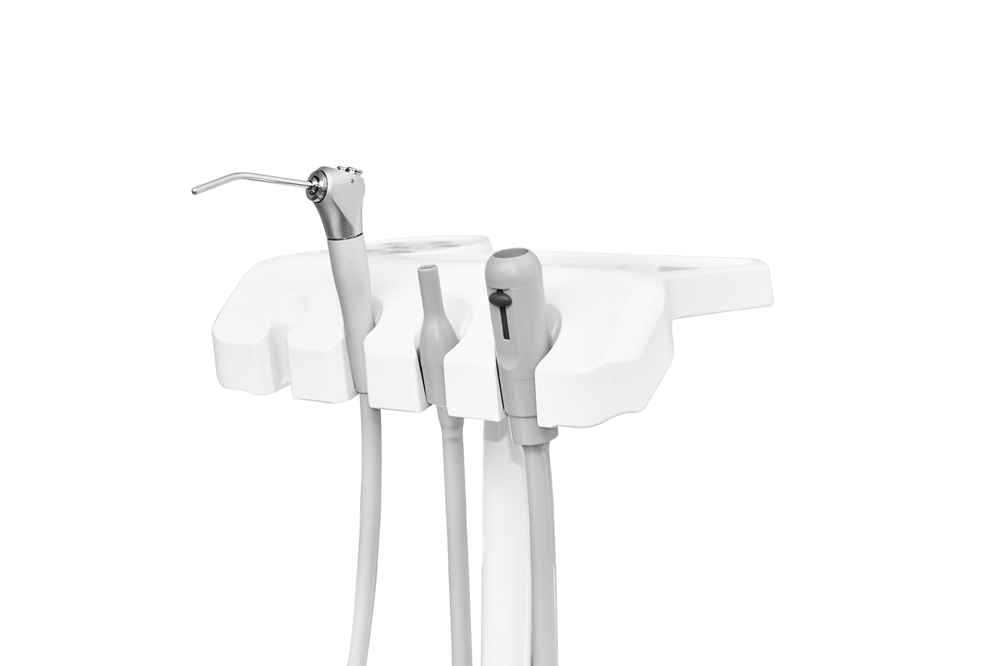

# Advanced Features and Components

The Roson Classic Model N2+ incorporates refined design choices and robust, advanced components tailored for highly efficient dental practices.

## 01: 8-Tooth Smile Oral Light

- **Double mode control**
- **Digital illumination and color temperature**
- **Infrared non-inductive control**
- **Philips lamp beads**
- **Manual shortcut control**
- **Condition breathing lamp**

## 02: Dentist table

- **Wide side (650*300mm) table:** Meets the needs of the dentist. Cleanable plastic pad protects the table for a longer life. Integral table handle is more convenient and highly efficient.
- **Swiveling instruments holder:** Handpiece holder with 5 positions, pre-positioned for scaler or electric motor.

## 03: Spittoon

- Provides more space for the assistant.
- **Ceramic spittoon:** 180 degree rotatable & easy to clean.
- **Programmable cup filler and spittoon rinsing system.**
- **Constant temperature warm water system.**
- **Pure water supply system.**

## 04: Detachable suction filter

- **New design suction filter:** Prevents bacteria from accumulating water inside with a filter net.
- **Easy maintenance:** Simple to take out for cleaning.

## 05: 5-in-1 Multifunctional Tissue Box

- **Dual-layer storage:** Designed for enhanced organization.
- **Eco-friendly:** High-durability materials.
- **Impact-resistant:** Wear-resistant edge design.
- **Innovative slide-mouth design:** Easy installation.

## 06: Water supply system

- **Independent disinfectant water supply system:** Ensures clean operation.

## 07: Assistant table

- **Control panel:** Includes full controls for chair movement.
- **Wide side table:** Meets the needs of the assistant.
- **3-way syringe:** Supports warm water.
- **Pre-positioned for curing light.**
- **Flexible movement:** Delivers a more convenient workspace.
