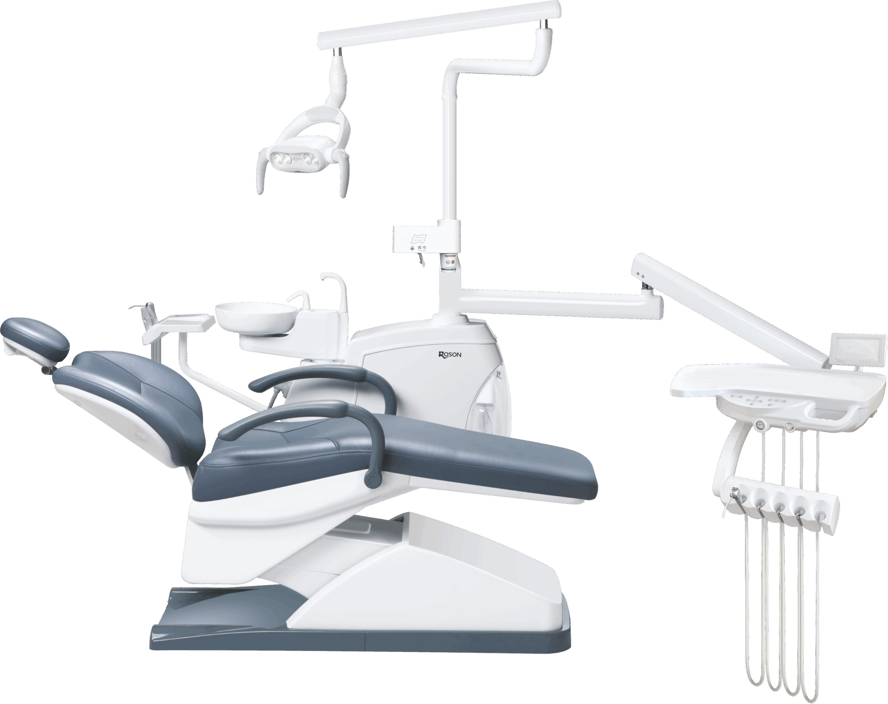
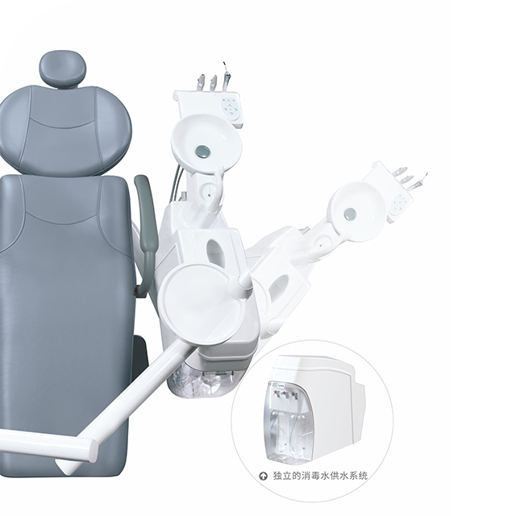
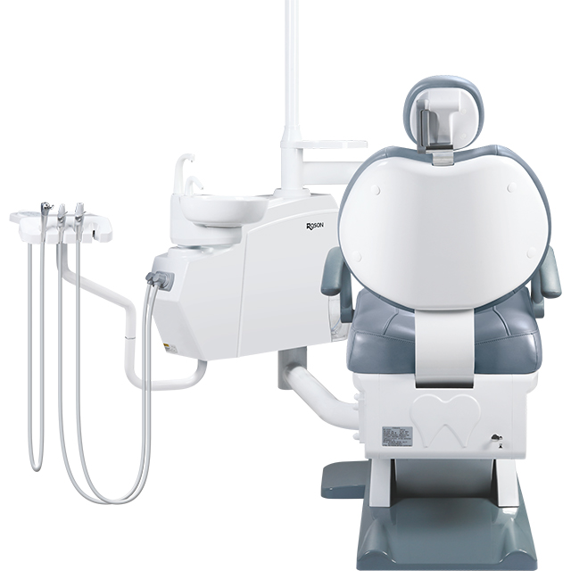

# Roson Classic Model N2+

The Roson Classic Model N2+ delivers an advanced dental unit boasting an ergonomic design, superior features, and a cost-effective build tailored for clinics that demand quality patient care without compromises.

## Configuration at a Glance
- **24V DC silent electric chair**
- **Automatic water supply system** (for spittoon flushing and cup water supplying)
- **Low mounted instrument tray** with an air brake device
- **Rotatable ceramic spittoon**
- **Three ways syringe** (cold/warm)
- **Multi-function foot control** (water flushing and water supply)
- **Strong/weak saliva suction device**
- **Seamless leather seat cushion, backrest, and foldable headrest**

## Key Features
- **Ergonomic Design:** Intuitive layout to simplify typical clinical motions.
- **Medical-Grade Color LCD Display:** Superior digital interface.
- **Durable and Easy-to-Clean:** Components engineered to simplify cleaning routines.
- **Multiple Color Choices Available:** Accommodate any clinic aesthetic.
