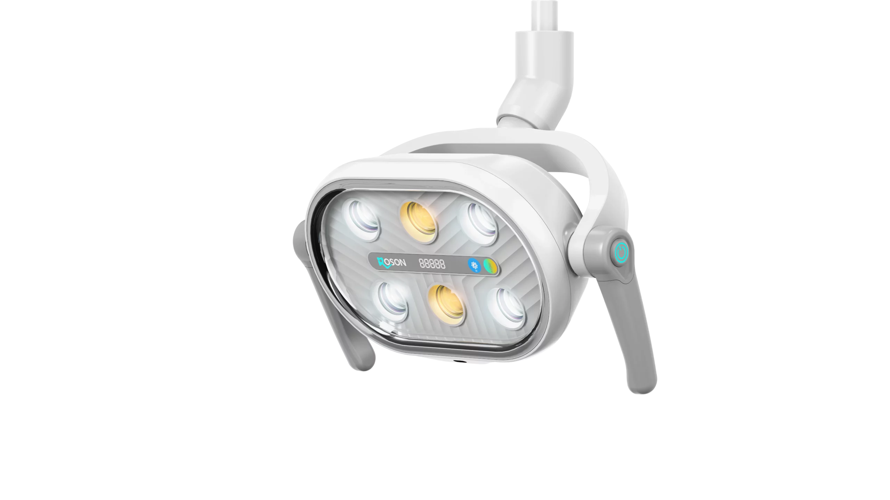
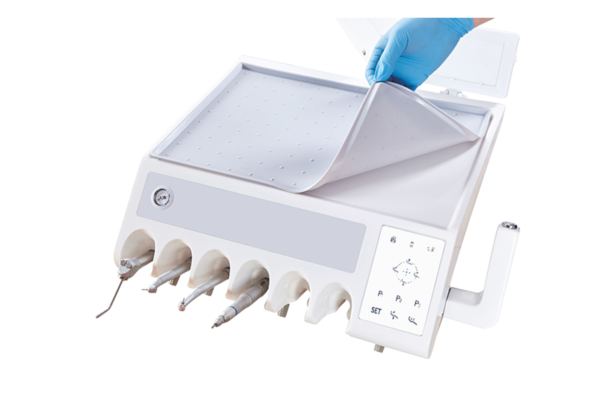
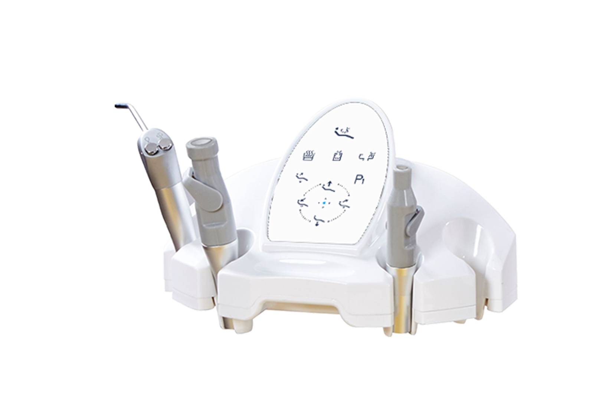
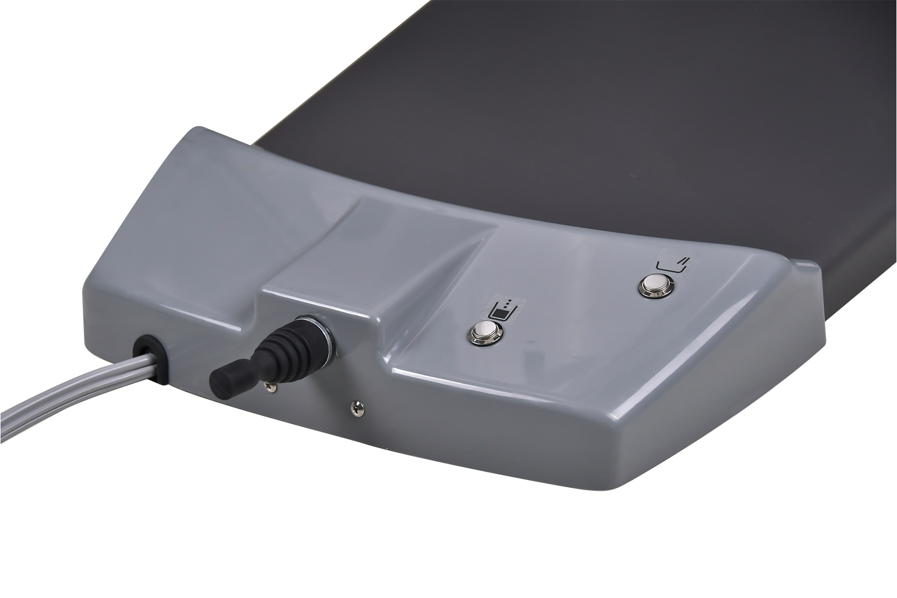
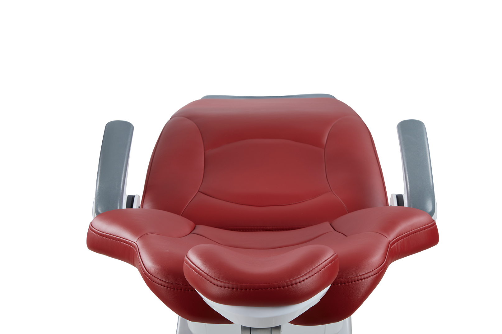
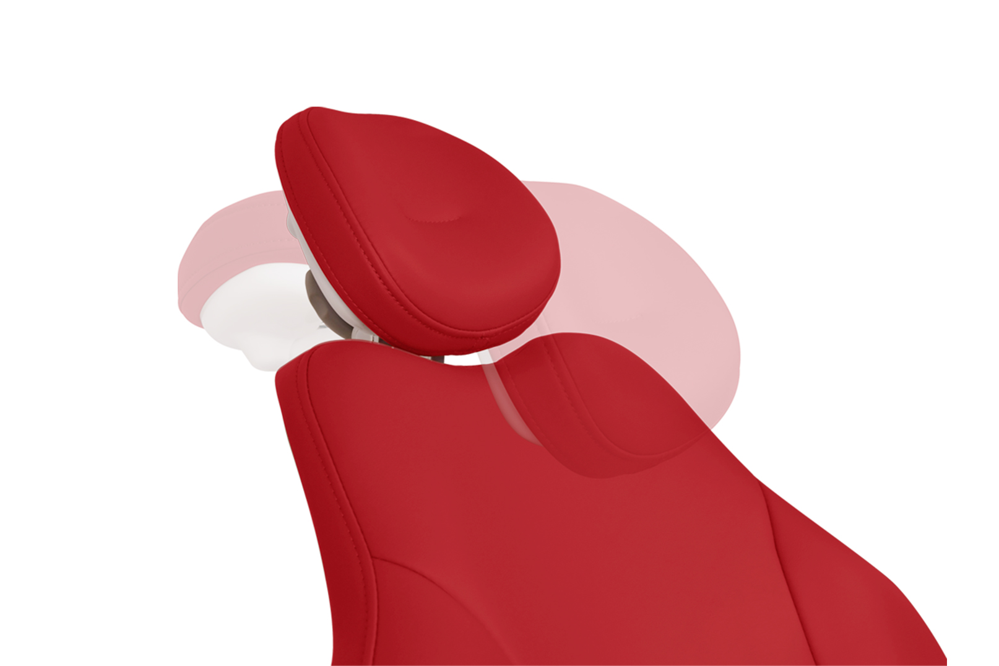
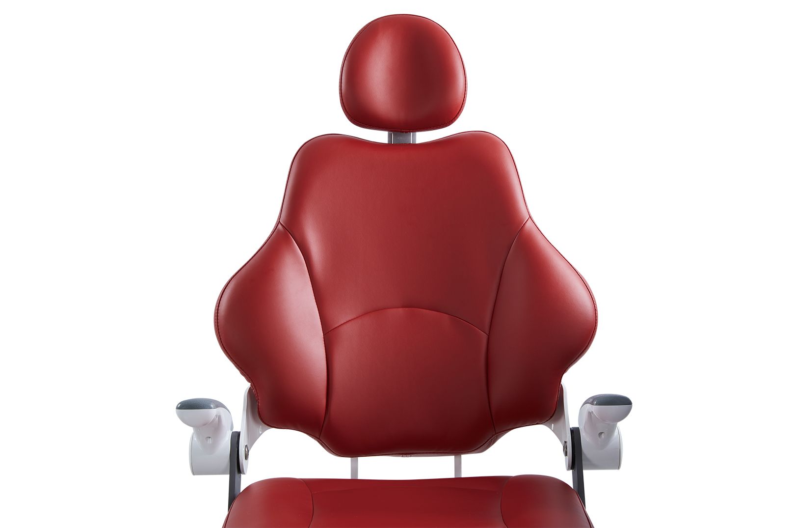

# Advanced Features for Superior Dental Care

## 01 Rolight S Dental Light

*   **Philips Lamp Beads:** Employs high-quality Philips LEDs for brilliant, natural-color illumination.
*   **Intuitive Controls:** Features manual shortcut controls along with a dynamic condition breathing lamp.
*   **Adjustable Settings:** Allows for precise digital control over illumination intensity and color temperature.
*   **Infrared Non-Inductive Control:** Enables touchless operation for improved hygiene and convenience.

## 02 Efficient & Compact Workflow

*   **Rapid Positioning:** The dentist's table can be quickly and effortlessly positioned using an ergonomic handle.
*   **Accessible Design:** The compact workflow layout ensures the dentist can reach instruments, the table, and the touch panel with minimal movement and time.
*   **Future-Proof:** Includes pre-positions meticulously designed for straightforward future upgrades.

## 03 Optimized for Four-Hand Operation

*   **Assistant Unit:** Features a flexible, swiveling, and compact assistant unit that is consistently easy to reach.
*   **Maximized Space:** Provides ample space for the assistant to work closely and effectively with both the dentist and the patient at all times.

## 04 Perfect Hands-Free Operation to Prevent Cross-Infection

*   **Comprehensive Foot Control:** Includes a versatile 4-way foot control that is intuitive and easy to use.
*   **Convenient Functions:** Integrates dedicated buttons for both the cup filler and the rinsing spittoon directly into the foot control system.

## 05 Enjoy the Optimized Space

*   **Ultra-Low Positioning:** Capable of dropping to a lowest position of 380mm, making it exceptionally easy for senior and pediatric patients to enter and exit.
*   **Maximum Comfort:** Combines an ergonomically designed backrest with flexible chair height adjustments to ensure the most comfortable treatment posture possible.

## 06 Stable Headrest

*   **Swift Adjustments:** Allows for faster positioning through a simple, one-handed operation utilizing two articulators.
*   **Multi-Joint Design:** The multi-joint headrest delivers unparalleled stability, making it particularly suitable for children and disabled patients.

## 07 Casting Steel Chair Frame and Backrest Support

*   **Robust Construction:** The solid, cast steel foundation provides exceptional durability and an unwavering sense of security and comfort for the patient.
