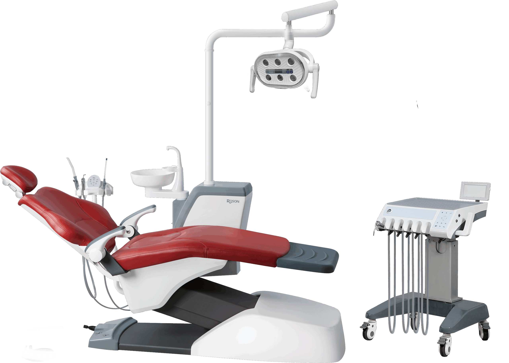

# Handpiece Placement Choices

The Professional Model S6 (KLT-6220 S6) provides flexible configuration options designed to support diverse operational preferences:

*   **Over-the-Patient (Continental Style)**
    
*   **Swing-Mounted (Traditional Hanging Style)**
    
*   **Cart-Mounted (Mobile Cart Style)**
    
