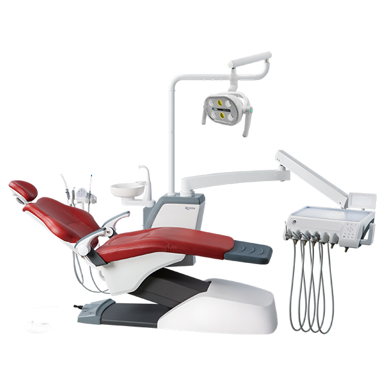
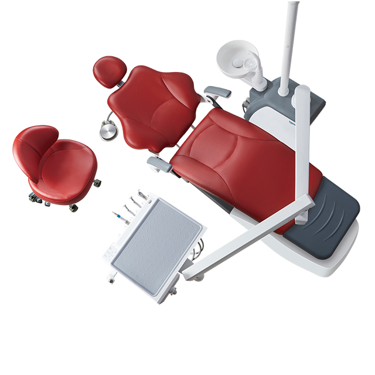
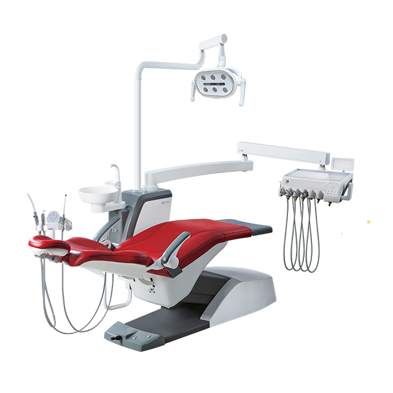
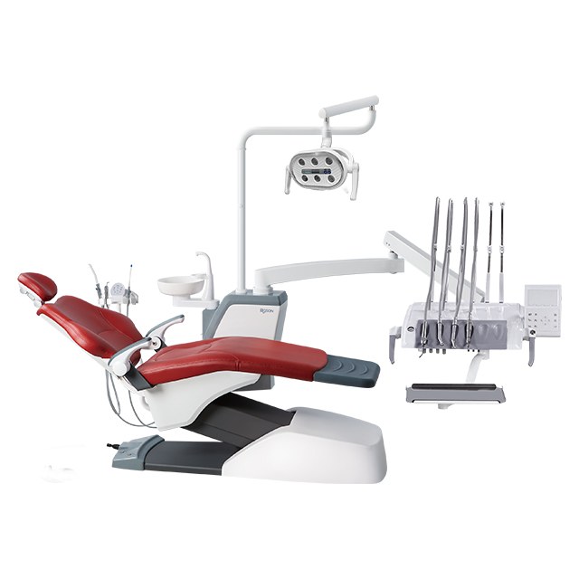
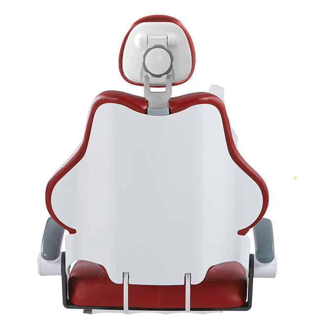
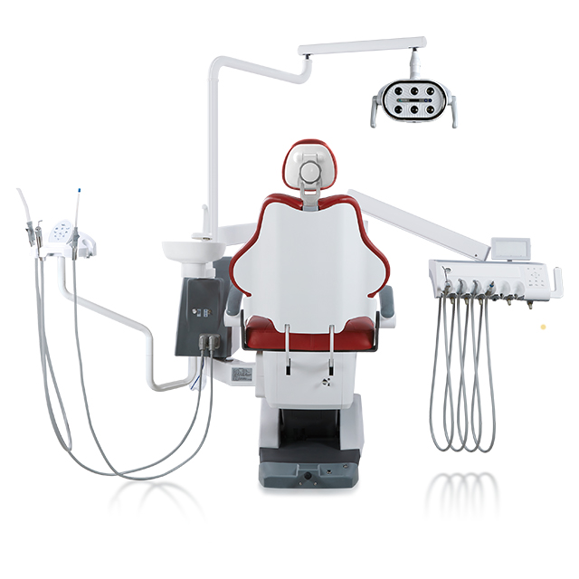

# Roson Professional Model S6 (KLT-6220)

## Ergonomic Design
The S6 Professional Model is designed with precision ergonomics, providing exceptional patient comfort and facilitating an optimized, strain-free clinical workflow.

## Medical-Grade Color LCD Display
Equipped with a high-definition, medical-grade color LCD screen, the S6 provides a clear and intuitive interface for monitoring and controlling all essential dental unit operations.

## Durable and Easy-to-Clean
Engineered with high-quality, resilient materials, the S6 chair guarantees long-lasting durability while remaining effortless to sanitize and maintain.

## Multiple Color Choices Available
Customize your operatory with a broad spectrum of elegant and professional unit colors, allowing the equipment to seamlessly blend with your clinic's interior design.

## Customizable Configuration
The S6 offers highly flexible configurations, customized according to your specific practice needs to ensure your dental chair perfectly complements your workflow.
