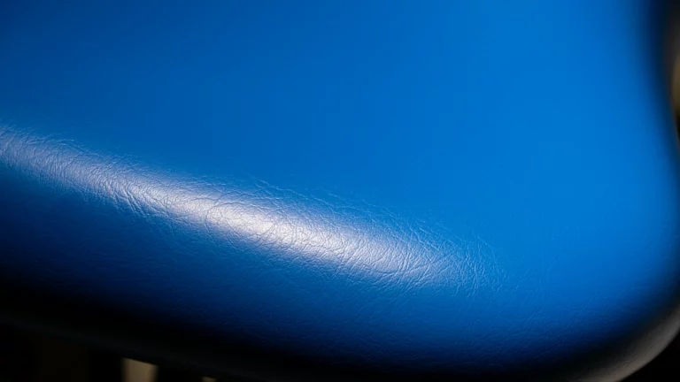
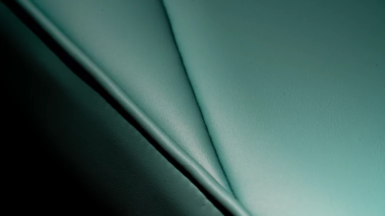

# Upholstery Selection

Customize the Professional Model S6 with your choice of high-quality upholstery materials:

*   **PU Leather:** Standard, durable, and exceptionally easy to clean.
    
*   **Sewn Microfiber Leather:** Offers refined aesthetics and superior tactile comfort with detailed stitching.
    
*   **Seamless Microfiber Leather:** Provides a sleek, modern look while maximizing infection control through its seamless, easy-to-wipe surface.
    
