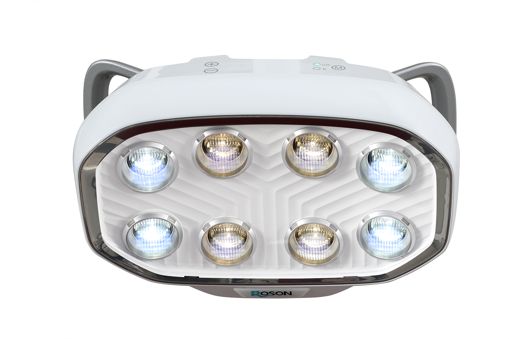
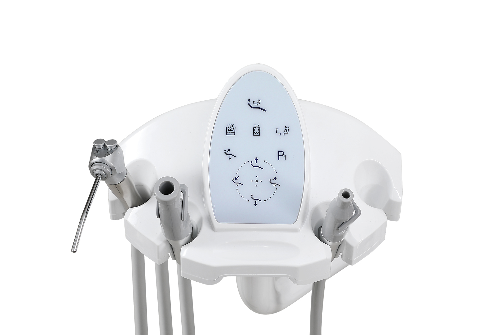
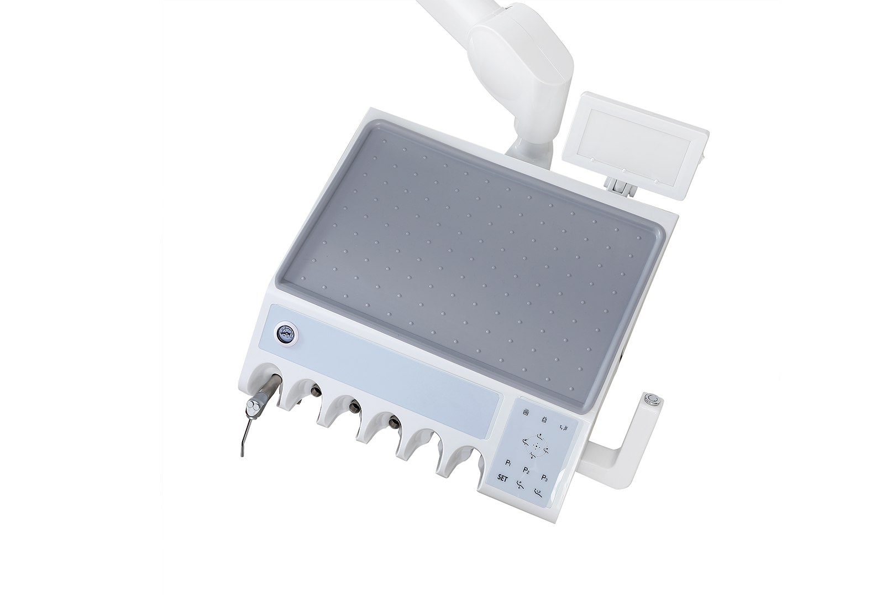
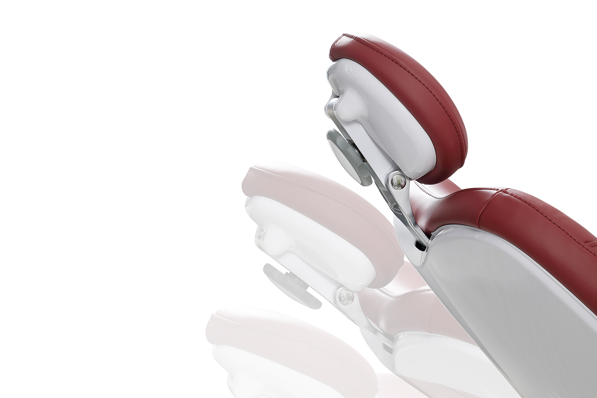
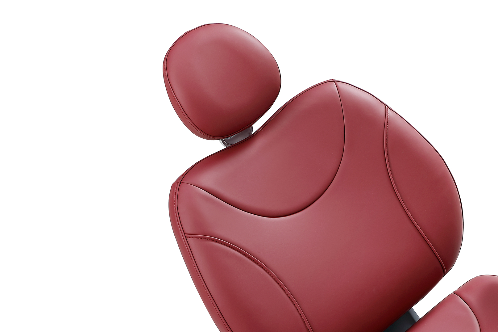
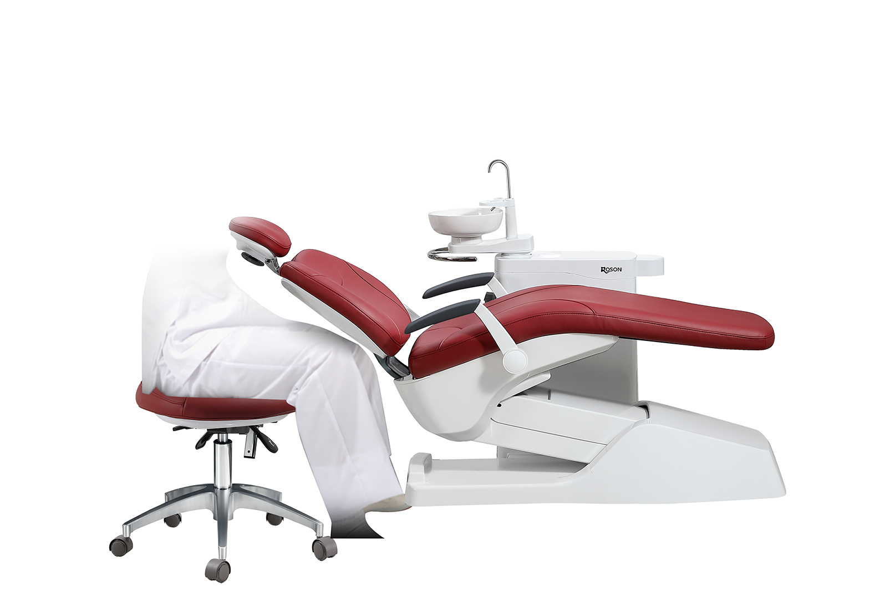
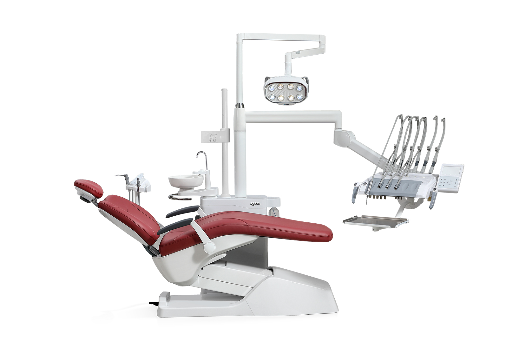

# Advanced Features and Components

The S9 model is equipped with a suite of advanced, user-centric features designed to optimize clinical workflow and elevate patient care.

## 8-Tooth Smile Oral Light (RoLight)

- **Natural Illumination:** Utilizes Philips LED bulbs to provide natural, daylight-mimicking illumination.
- **Customizable Environment:** Features adjustable brightness (8,000 to 35,000 Lux) and color temperature (4,000K to 5,300K).
- **Precision Control:** Includes a digital control display for exact visual settings.
- **Eye Protection:** Designed with a comfortable light spot to minimize eye strain and protect both patient and practitioner.

## Efficient & Compact Workflow

- **Ergonomic Console:** Features a 45-degree angled operation panel designed for highly efficient, effortless access.
- **Smart Memory:** Includes 3 preset memory positions, significantly easing the dentist’s daily operational workflow.

## Compact Assistant Unit
- **Streamlined Access:** A flexible, swiveling assistant unit that is easy to reach while providing extra operational space.
- **Optimized for Teamwork:** Specifically engineered and optimized for seamless four-handed dentistry.

## Soft Start/Stop System
- **Uninterrupted Comfort:** Specialized motor control ensures smooth, frustration-free movement, keeping patients relaxed and comfortable at all times.

## Leather Upholstery

- **Supreme Comfort:** Described as "as comfortable as sitting on a throne."
- **Premium Materials:** Elastic, skin-friendly, eco-friendly, and ultra-breathable materials designed for maximum patient coziness.

## Anti-Collision System for Backrest
- **Intelligent Safety:** The backrest is equipped with sensors that automatically pause and reverse the chair's movement if an obstacle is detected, preventing damage or injury.

## 5-in-1 Multifunctional Tissue Box

- **Enhanced Organization:** Features dual-layer storage for cups, tissues, and small essentials.
- **Durable Construction:** Made from eco-friendly, impact-resistant, and wear-resistant materials.
- **Convenient Design:** Incorporates an innovative slide-mouth design for rapid, easy installation and refilling.

## One-Key Smart Drainage Position
- **Automated Cleaning:** A single-button activation streamlines your end-of-day cleaning routine.
- **Efficient Operation:** Automatically raises the chair to its highest position and triggers a comprehensive 5-minute spittoon flushing cycle.

---

# Advanced Micro-electrolysis Disinfection (EOW-TECH)

The S9 incorporates revolutionary EOW-TECH to ensure flawless hygiene and safety.
- **Exceptional Disinfection:** Eliminates 99.9999% of bacteria, setting a new standard in dental hygiene.
- **Biofilm Prevention:** Actively inhibits biofilm formation, drastically reducing the risk of cross-contamination.
- **Non-toxic and Gentle:** Produces safe, medically-verified active oxygen clusters for completely irritation-free use.
- **Adaptable Water System:** Sophisticated electrolyte adaptation ensures optimal performance in varying water conditions.
- **Eco-friendly Operation:** Leaves zero harmful residues—water is the sole by-product of the entire process.
- **Corrosion-free Technology:** Contains no free chlorine ions, fully protecting your dental unit's internal metal components.

---

# Dynamic Comfort: The RS06 Dentist's Stool

The S9 comes paired with the highly ergonomic RS06 Dentist's Stool, engineered for postural health:
- Eight-way adjustability to fit any practitioner perfectly.
- Features a 5° forward tilt capability that maintains the natural curvature of the spine and prevents femoral artery blockage.
- Built with ultra-breathable material, non-deformable cushioning, 360° silent casters, and a highly sturdy aluminum alloy base.
