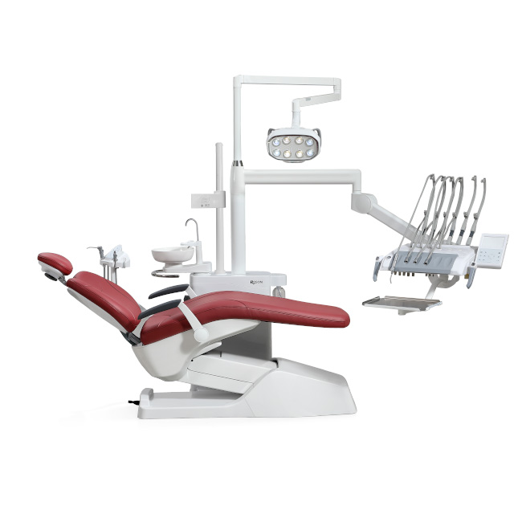
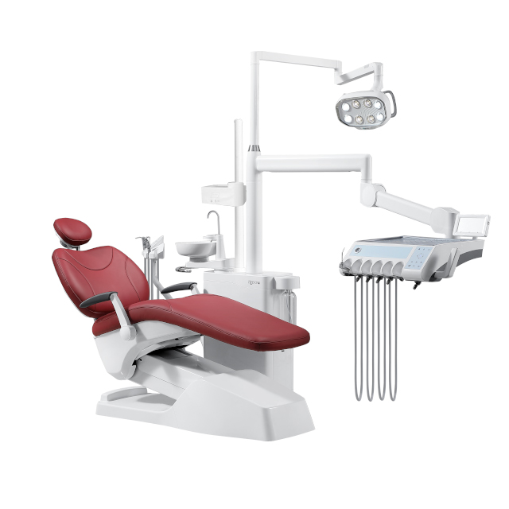
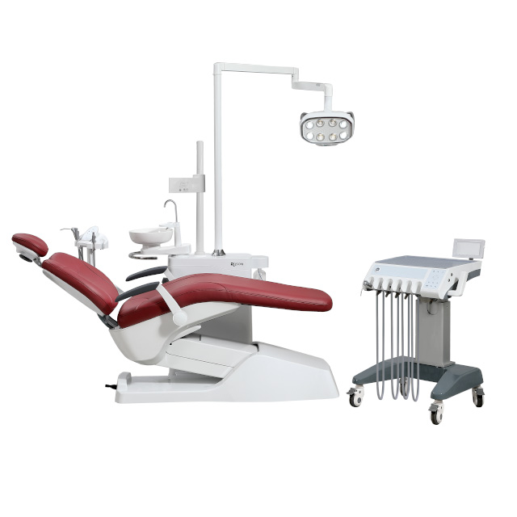
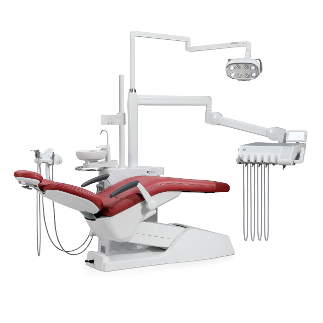

# Roson Affordable Luxury Model S9

The Roson Affordable Luxury Model S9 dental unit is engineered to deliver exceptional value without compromising on premium performance. It blends ergonomic comfort with advanced technology to create an ideal environment for both dentists and patients.

## Key Features

- **Ergonomic Design:** Masterfully crafted to provide maximum comfort for the patient and unparalleled access for the dentist.
- **Medical-Grade Color LCD Display:** Features a high-resolution, intuitive interface for complete, effortless control of the unit's systems.
- **Advanced Disinfection System:** Includes state-of-the-art EOW-TECH micro-electrolysis disinfection to guarantee the highest standards of clinical hygiene.
- **Durable and Easy-to-Clean:** Constructed from premium, hard-wearing materials that stand up to rigorous daily use while simplifying sanitation protocols.
- **Extensive Customization:** Available with multiple color choices and specific configurations tailored entirely to meet your unique practice requirements.

## Industry-Leading Warranties

The Model S9 is supported by comprehensive warranties, ensuring long-term peace of mind and reliability:
- **Water & Air Pipelines:** 5-year Warranty
- **Breathable Seamless Microfiber Leather:** 5-year Warranty
- **TIMOTION Motor:** 5-year Warranty
- **RoLight Dental Light:** 3-year Warranty
